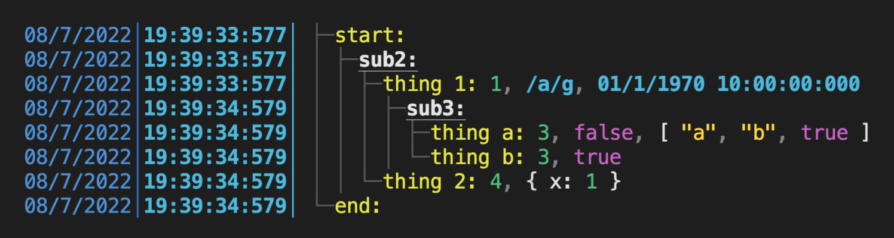
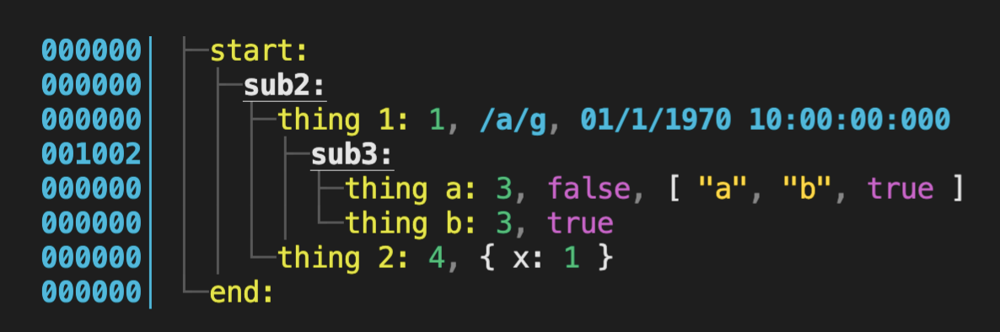
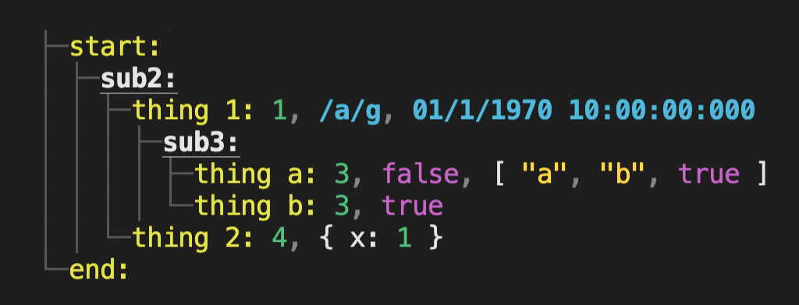

# Turbo Log


[](http://commitizen.github.io/cz-cli/)

Simple but powerful nested logging for debugging and testing!

Works in both the **Browser** and **NodeJS** with zero-dependencies and a tiny bundle size of `5kb` (`2kb` gzipped!).

## Install

As turbo-log is intended to be included with your production application (see below for enabling/disabling), it should be installed as a direct dependency.

```bash
npm install turbo-log
```

## Usage

The public API consists of the following functions.

| Function                                                           | Description                                                                                                                                                                 |
| ------------------------------------------------------------------ | --------------------------------------------------------------------------------------------------------------------------------------------------------------------------- |
| `log(label: string, ...data?: any:[]): void`                       | Add a log entry to current stack head with the given label and data                                                                                                         |
| `pushLog(label: string): void`                                     | Increase the indentation level and create a new stack head with the given label                                                                                             |
| `popLog(): void`                                                   | Decrease the indentation level and pop the stack head                                                                                                                       |
| `clearLog(): void`                                                 | Clear the log buffer                                                                                                                                                        |
| `printLog(logOptions?: LogOptions & { silent?: boolean }): string` | Render the current log buffer to the the console (pass `silent:true` to skip console output), and returns the outputted string (will contain formatting if `useColor:true`) |
| `snaphotLog(): string`                                             | Return the current log buffer as a plain text snapshot as a string                                                                                                          |
| `setLogOptions(options: Partial<LogOptions>): void`                | Set global logging options                                                                                                                                                  |

Import as es6 modules, commonjs, or UMD.

```javascript
// es6 modules
import { log, ... } from 'turbo-log';

// or commonjs
const { log, ... } = require('turbo-log');

// or UMD global in the browser
const { log, ... } = window.turbo_log;

// log it!
log('some-event', someValue, anotherValue...);
```

### Safari Usage

If using `turbo-log` with Safari you'll need to ensure the default encoding setting is set to `UTF-8` so the dev tools display the characters correctly. Open the "Advanced" page of the Safari's preferences and see this [link](https://github.com/vuejs/vitepress/issues/218#issuecomment-780999845) for an example.

## Logging

Logging is broken down into individual log entries. Each entry consists of a string label, followed by any arbitrary values using the `log(label: string, ...data?: any[])` function. Only the label is required. Entries can be nested _(see "Nesting" section for more info)_.

The `label` is an arbitrary string used for context and can be anything, usually you would make it something to do with the current context reason of the log entry. Think of it like an event name.

The rest of the function parameters become the data for that log entry.

```javascript
import { log } from 'turbo-log';

log('some label', someValue, anotherValue, someObject...);
```

The values after the label are optional, you can just log the label if required.

```javascript
log('just a label');
```

## Nesting

Log entries can be nested by increasing or decreasing indentation with `pushLog(label: string)` and `popLog()`. This creates a stack-like mechanism and any further `log()` entries get nested under the current stack head. This is very useful to capture the stack-like behaviour of executing code.

Here's a complete example:

```javascript
import { log, pushLog, popLog, printLog, setLogOptions } from 'turbo-log';

// setup as part of app initialisation
setLogOptions({
  enabled: true,
  showTimeStamp: false,
  useTimeDelta: true,
  useColor: true,
});

async function main() {
  log('start');
  await sub2Func();
  log('end');
}

async function sub2Func() {
  pushLog('sub2'); // <- push a new head onto the stack
  log('thing 1', 1, /a/g, new Date(0)); // <- subsequent log calls are now nested
  await sub3Func();
  log('thing 2', 4, { x: 1 });
  popLog(); // <-- when we're done with this level we pop
}

function sub3Func() {
  return new Promise((resolve) => {
    setTimeout(() => {
      pushLog('sub3');
      log('thing a', 3, false, ['a', 'b', true]);
      log('thing b', 3, true);
      popLog();
      resolve();
    }, 1000);
  });
}

// do stuff, then print the log to the console
main().then(() => {
  printLog();
});
```

> Just remember for every `pushLog()` call to include a corresponding `popLog()` call to balance the stack.

## Viewing Log Output

To output the log to the console or terminal, use `printLog()` to return a string.

```javascript
import { printLog } from 'turbo-log';

// perform logging during application runtime...

printLog();
```



## Log Options

There are several options to control logging which can be set via the `setLogOptions(options: Partial<LogOptions>)` function where `LogOptions` is defined as:

| Property                           | Default       | Description                                                                                                                                                                                                                                                                                                                                           |
| ---------------------------------- | ------------- | ----------------------------------------------------------------------------------------------------------------------------------------------------------------------------------------------------------------------------------------------------------------------------------------------------------------------------------------------------- |
| `enabled: boolean`                 | `false`       | Enable or disable logging. By default logging is disabled and must be opted-in. This allows for the integration of logging as a first class citizen without creating noise for end users by default                                                                                                                                                   |
| `showTimeStamp: boolean`           | `true`        | Show the timestamp prefix for each line                                                                                                                                                                                                                                                                                                               |
| `useTimeDelta: boolean`            | `false`       | Use the milliseconds delta since the last entry, or use the full date and time                                                                                                                                                                                                                                                                        |
| `useColor: boolean`                | `true`        | Output using ansi color codes, or just plain text                                                                                                                                                                                                                                                                                                     |
| `stringProviderMethodName: string` | `"toLogInfo"` | The method name to look for when converting argument objects to strings. This method will be called if found on an object, falling back to native string conversion for that type. This makes objects "log aware" if needed. For example logging this object `{toLogInfo: () => 'my log data'}` will display `"my log data"` for the log entries data |

`setLogOptions({ useTimeDelta: true })` will show the delta in milliseconds between calls instead of the full datetime.



Or if you don't want the timestamp prefix at all `setLogOptions({ showTimeStamp: false })`.



For CI environments or terminals which don't support color `setLogOptions({ useColor: false })`.


## Enabling / Disabling Logging

By default logging is enabled, though you may not want the output during production.

Therefore it's recommended to use an environment or build variable, query parameters, or localStorage to dynamically enable it at runtime based on the environment during your application startup.

```javascript
/// during app startup...

import { setLogOptions } from 'tree-log';

setLogOptions({ enabled: !!process.env.LOGGING });
```

> In Browser environments you'll receive a single message `turbo-log is disabled.` if logging is disabled and log calls are made.

The library is designed to be integrated with production code, but create zero overheads when needed. When disabled, logging calls can still be called but there will no updates to the log buffer, or extra memory consumed. This effectively turns the log functions into no-ops which ensures virtually zero overhead for leaving the logging calls in place.

## Migrating

### From `2.0.x` to `2.1.x`

- Logging enabled by default, no need to opt-in though still recommended to use env/build vars during app startup to enable/disable as needed

### From `1.x` to `2.x`

- Browser support added
- `renderLog()` was replaced with `printLog()` and `snapshotLog()`. `printLog()` now renders to the console, whereas `snapshotLog()` returns a string as `renderLog()` did

### From `0.x` to `1.x`

- `setLogEnabled()` was replaced with global settings `setLogOptions({ enabled: boolean })`
- `renderLog(options)` was replaced with global settings `setLogOptions(...)`. Use the same properties globally once rather per render call

## Use Cases

### Integrated Logging & Diagnostics

This library is lightweight and can be used a general purpose logging tool. Logging is retained in memory and can be serialised when needed. Being able to nest statements creates a great tool for diagnostics, troubleshooting, and performance tuning. Logging statements can be left in production and the logging functionality is disabled by default. This allows for debugging and logging to be a first class citizen of a code base without requiring constant local development changes or accidental code garbage, in both Node and the Browser.

Recommended use case is to integrate logging statements in desired locations of application, then run a known sequence and print the log to see what was captured.

### Snapshots for Unit Tests

Since the log can be serialised with or without a timestamp or color, it can be used as a text snapshot for integration testing (eg. using Jest text snapshots) via `snapshotLog()`. Having your application log during testing and then comparing that serialised log to the previous snapshot will uncover any changes in determinism or order of events, race conditions, or over calling.

> Note that `snapshotLog()` disables the timestamp prefix since times or deltas would vary between tests and cause noisy failures.

```javascript
// using Jest...

import { snapshotLog } from 'turbo-log';

it('should match snapshot', () => {
  // setup, perform test operations with logging enabled...

  expect(snapshotLog()).toMatchSnapshot();
});
```

## Roadmap

This project is actively under development. The following features are planned for upcoming releases.

| Feature                    | Bump               | Description                                                                                                                                                                                                                                                                        |
| -------------------------- | ------------------ | ---------------------------------------------------------------------------------------------------------------------------------------------------------------------------------------------------------------------------------------------------------------------------------- |
| **Realtime logging**       | `minor`            | Currently logging needs to be rendered and printed to the console as needed. Will provide a setting to stream log to the console in realtime                                                                                                                                       |
| **Log buffer limit**       | `minor`            | Current log buffer is unlimited. Will provide an API to adjust max length and purge last in when limit exceeded                                                                                                                                                                    |
| **Expose log buffer**      | `minor`            | The log buffer will be exposed which will allow for custom queries on log details                                                                                                                                                                                                  |
| **Themes**                 | `minor`            | Current theme is dark biased but works in light consoles. Will add a dedicated light theme as part of options or possibly ability to set token colors                                                                                                                              |
| **Multi-Instance Logging** | `major`            | Currently there is only one log buffer. Would like to make the ability to create multiple log buffers, to isolate diagnostics as needed                                                                                                                                            |
| **Browser Widget**         | `separate package` | Browser logging would benefit from more functionality including search, filtering, and deeper inspection. This is beyond basic console output and would require a floating widget in page. A floating widget would be preferred over a browser extension for full browser support. |

## Issues & Contributing

Found a bug or problem? Please [let me know](https://github.com/dragonworx/turbo-log/issues/new)! Pull Requests and feature ideas always welcome!
